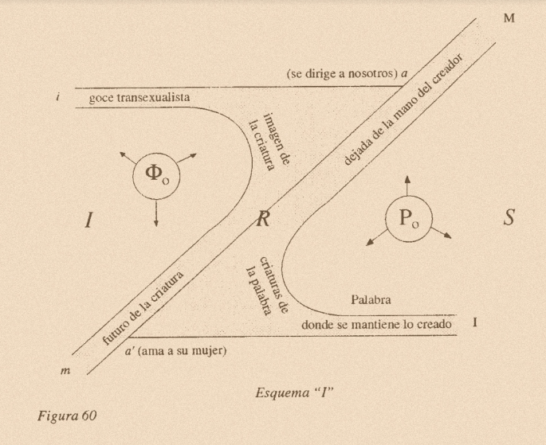

<!-- TOC start (generated with https://github.com/derlin/bitdowntoc) -->

- [Vendas - Clínica Psicanalítica](#vendas-clínica-psicanalítica)

- [Talles Barrini](#talles-barrini)

- [Psicanalista Talles Barrini](#psicanalista-talles-barrini)

- [A quem se destina?](#a-quem-se-destina)

- [Por que iniciar uma análise?](#por-que-iniciar-uma-análise)

- [O que se pode esperar da análise?](#o-que-se-pode-esperar-da-análise)

- [Quanto custa?](#quanto-custa)

- [Quanto tempo demora?](#quanto-tempo-demora)

- [Captação de Clientes para a Psicanálise](#captação-de-clientes-para-a-psicanálise)

- [Plano de vendas - Grupo de sessões](#plano-de-vendas-grupo-de-sessões)

- [Estratificação de clientes](#estratificação-de-clientes)

- [Atendimento Online](#atendimento-online)

- [Atendimento Presencial para casos especiais](#atendimento-presencial-para-casos-especiais)

- [Clínica e Escola de Psicanálise](#clínica-e-escola-de-psicanálise)

- [Grupos e Canais](#grupos-e-canais)

- [Trabalhe conosco](#trabalhe-conosco)

- [Obrigado!](#obrigado)

- [Lógica e Direção do Tratamento](#lógica-e-direção-do-tratamento)

- [Letra, Gozo](#letra-gozo)

- [Casos Clínicos](#casos-clínicos)

- [Unheimlich](#unheimlich)

<!-- TOC end -->

# Vendas - Clínica Psicanalítica

# Talles Barrini

# Psicanalista Talles Barrini

 **Talles Barrini é Psicanalista clínico\, Supervisor\, Engenheiro de Computação pelo Instituto Tecnológico de Aeronáutica \(ITA\)\, Escritor de roteiros\, Produtor e Diretor de cinema\. Trabalha na interface entre Psicanálise\, Cinema e Linguagens produzindo cursos clínicos e teóricos\, filmes\, textos e roteiros\, participando e organizando palestras\, grupos de estudos e pesquisas nessas aŕeas\. Pesquisador na área de Inteligência Artificial\, Psicanálise\, Lógica\, Filosofia da Linguagem através da elaboração de algoritmos\, esquemas e grafos a partir de diálogos com as obras de Freud\, Lacan\, Judith Butler e Hegel e outros\. ** 

 **Experiência com questões em diversos mercados de trabalho: Concurso público\, Forças Armadas\, Empreendedorismo\, Universidades\, Sexualidades\, Migração\, Classe e Raça\.**   **Dimensão do Dito e construção da fantasia\. Sujeitos\-Máquinas paranóicas\, melancólicas\, perversas\, maníacas\-histéricas\-obsessivas\, toxicômonas\, bulímicas\, anorexicas \(objeto\-maníacas\, nada\, a\-mais\-de\-gozar\) ** 

# A quem se destina?

Crise de gozo

Queda da fantasia

Questões Identitárias em crise: LGBTQIAP\+s\, raças\, classes

Mudanças abruptas\, disruptivas: classe\, migração\, transexualidades

Significantes: depressão\, neurose\, amor\, solidão\, estrangeiro\, imigração\, estranho\, familiar\, compreensão

Amor\, separação\, solidão

Luto

# Por que iniciar uma análise?

O dito transforma a dimensão da vida: relação com os outros\, consigo mesmo\, a fantasia frente ao Real

Efeito de verdade no dizer: o depósito de uma verdade sobre a vida é aquilo de mais valioso que existe

Porque pagamos sempre\, de um jeito ou de outro\. pagamos com nosso ser\, com o sofrimento\, com insatisfação\, com culpa\, pesadelos\, com angústia\, com ansiedade\, inibição\, vergonha\, medo\.

Passamos a vida a culpar a nós mesmos\, aos outros\, ao mundo e ao elaborar essas questões vivemos melhor\, com mais potência e mais amor

Dizer é uma arte

# O que se pode esperar da análise?

Construção da fantasia

Efeito de verdade

Compreensão\, depósito sobre modulações de gozo\, desejo\, culpa\, luta

A vida\, a morte\, o escrito\, o outro\, o Outro

Efeitos terapéuticos

Reposicionamento\, construção subjetiva

Trocas\, amor\, fluxos

Possibilidade de um posicionamento frente ao mundo\, ao trabalho\, a outros

Escrita artística

# Quanto custa?

Investimento: a partir de 150\,00 / sessão

Percurso subjetivo\, depende da demanda de entrada\, do fluxo no percurso\!

# Quanto tempo demora?

**Bons resultados: 10 \- 20 sessões**

Processo padrão: 20 \- 50 sessões

Análise longa > 50 sessões

Sessão padrão: 45 minSessões de duração variável

Frequência padrão: semanalPossibilidades: mais de uma vez por semana\, quinzenal\, mensal\, bimensal\, trimestral\, semestral\, anual\. Formas de contar o encontro\.

# Captação de Clientes para a Psicanálise

Comissão: 20% do ticket do cliente/sessão

Fechamento de pacotes de sessões

Pix para pagamento

# Plano de vendas - Grupo de sessões

Mínimo 5 sessões \- Desconto 5%

Grupo de 10 sessões \- Desconto 7%

Grupo de 20 sessões \- Desconto 9%

Grupo de 30 sessões \- Desconto 11%

Grupo de 50 sessões \- Desconto 13%

# Estratificação de clientes

Objetivos: 4 Clientes de cada faixa

Cliente básico: 80\,00 \- 150\,00

Cliente médio 150\,00 \- 300\,00

Cliente silver 300\,00 \- 600\,00

Cliente gold 600\,00 \- 2000\,00

Cliente Platinum > 2000\,00

# Atendimento Online

Como se preparar?

Lugar silencioso e sem interrupções

Testar áudio e vídeo

Tranquilidade com imprevistos

Usar computador\, telefone ou tablet

Sala para atendimento: https://meet\.google\.com/htw\-hkei\-dyy

Sala de espera: https://meet\.google\.com/hmk\-dsnj\-mee

# Atendimento Presencial para casos especiais

Boa Esperança\, MG

Rua Otaviano Monteiro\, 183\, Vila Belém

Horários a combinar

# Clínica e Escola de Psicanálise

Drive:  _[https://drive\.google\.com/drive/folders/1RVQs75Obb9ZXaLrUQwucCaye87eqvoHr?usp=sharing](https://drive.google.com/drive/folders/1RVQs75Obb9ZXaLrUQwucCaye87eqvoHr?usp=sharing)_

Link do curso Figuras em Psicanálise e mais informações:  _[https://go\.hotmart\.com/V85752654T](https://go.hotmart.com/V85752654T)_

Link do curso Psicanálise e Inteligência Artificial e mais informações:  _[https://go\.hotmart\.com/B85742391D](https://go.hotmart.com/B85742391D)_

Sociais e outros:  _[https://linktr\.ee/tallesbarrini](https://linktr.ee/tallesbarrini)_

# Grupos e Canais

WhatsApp Talles Barrini:  _[https://chat\.whatsapp\.com/JGlGyJQirVK2nshslvTsen](https://chat.whatsapp.com/JGlGyJQirVK2nshslvTsen)_

WhatsApp Afiliados:  _[https://chat\.whatsapp\.com/Ebe8zQC1oLjLGDuKC8by8I](https://chat.whatsapp.com/Ebe8zQC1oLjLGDuKC8by8I)_

Canal Telegram:  _[https://t\.me/tallesbarrini](https://t.me/tallesbarrini)_

# Trabalhe conosco

Afiliação na Clínica:  _[https://docs\.google\.com/presentation/d/1vQM9e4Kf_cHFwBQ1S3Kq_fLYDmRRSkZaZgpE2AZkzCA/edit?usp=sharing](https://docs.google.com/presentation/d/1vQM9e4Kf_cHFwBQ1S3Kq_fLYDmRRSkZaZgpE2AZkzCA/edit?usp=sharing)_

Afiliação de Cursos teóricos:  _[https://docs\.google\.com/presentation/d/1i9oTmgf7CVcJT5UJhIEH3IWZuu8rAkJLrzyNuLNeus0/edit?usp=sharing](https://docs.google.com/presentation/d/1i9oTmgf7CVcJT5UJhIEH3IWZuu8rAkJLrzyNuLNeus0/edit?usp=sharing)_

Psiquiatras\, Assistentes Sociais\, Educação:  _[https://docs\.google\.com/presentation/d/1fGxKy0PeQVmguioEpAheQGGR8vJUilGqCWMzFmQvtcs/edit?usp=sharing](https://docs.google.com/presentation/d/1fGxKy0PeQVmguioEpAheQGGR8vJUilGqCWMzFmQvtcs/edit?usp=sharing)_

Cinema:  _[https://docs\.google\.com/presentation/d/1MGYJgJPWMmoz7mkZWdFOs3cxNQC9fnZreEX7RP_o5Mw/edit?usp=sharing](https://docs.google.com/presentation/d/1MGYJgJPWMmoz7mkZWdFOs3cxNQC9fnZreEX7RP_o5Mw/edit?usp=sharing)_

# Obrigado!

**Talles Barrini**

@tallesbarrini

https://linktr\.ee/tallesbarrini

# Lógica e Direção do Tratamento

**Lógica de Entrada**

Lógica de Saída

Contagem do analisante

**Outro**

GozoBarramento de gozoEstratégia com a Letra

**Grafo do desejo**

Desejo\, Demanda: Matema do Discurso do AnalistaNomear \(S1\)\, Gozo a menos\, Angústia \(Sujeito barrado\)

**Travessia da Fantasia**

Letra chinesa:Sem garantia\, produção de estratégias\, invenção e responsabilidade

**Direção do Tratamento**

Demanda de análise: Pedido de amor\, compreensão\, estratégia de gozo

# Letra, Gozo

Freud\, Lacan\, Klein\, etc\.

Casos clínicos\, estratégias

**Estudos Teóricos**

# Casos Clínicos

NeurosesPsicosesPerversõesMais\-de\-gozar\, Cálculo e Barramento de GozoLetrasAmor: renúncia à restituição\, à reinvindicação

# Unheimlich

**Invenção/Responsabilidade**
