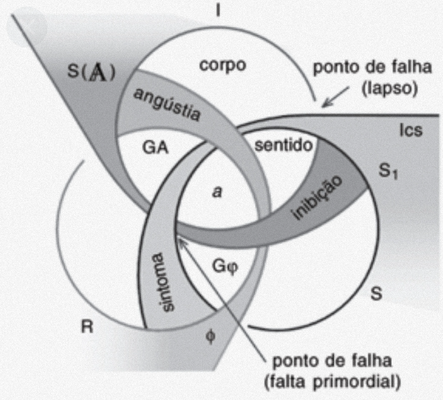

<!-- TOC start (generated with https://github.com/derlin/bitdowntoc) -->

- [Percurso em Psicanálise](#percurso-em-psicanálise)

- [Talles Berrini](#talles-berrini)

- [Letra, Gozo](#letra-gozo)

- [Alternativa](#alternativa)

- [Percurso Pessoal](#percurso-pessoal)

- [Percurso](#percurso)

- [Literatura Psicanalítica](#literatura-psicanalítica)

- [Nosso curso](#nosso-curso)

- [Biografia, Conceitos, Casos Clínicos](#biografia-conceitos-casos-clínicos)

- [A direção do tratamento e os princípios de seu poder](#a-direção-do-tratamento-e-os-princípios-de-seu-poder)

- [Estrutura: Entrada em análise, direção, saída de análise](#estrutura-entrada-em-análise-direção-saída-de-análise)

- [A ORDEM SIMBÓLICAA SUPREMACIA DO SIGNIFICANTE](#a-ordem-simbólica-a-supremacia-do-significante)

- [Escola, Ensino, Conceitos](#escola-ensino-conceitos)

- [A ORDEM SIMBÓLICAA SUPREMACIA DO SIGNIFICANTE](#a-ordem-simbólica-a-supremacia-do-significante-1)

- [Escola, Pesquisa](#escola-pesquisa)

- [Clínica tradicionalSupervisão clínicaGrave e envie/Receba um Feedback Análise de vídeos, textos e áudios de analisantesCursos Teóricos (Vídeo Aulas, slides, textos)Escrita e Publicação (Livros, artigos)Parcerias, MarketingRedes Sociais: YouTube, Instagram, Tiktok (Ferramentas, Como fazer)](#clínica-tradicional-supervisão-clínica-grave-e-enviereceba-um-feedback-análise-de-vídeos-textos-e-áudios-de-analisantes-cursos-teóricos-vídeo-aulas-slides-textos-escrita-e-publicação-livros-artigos-parcerias-marketing-redes-sociais-youtube-instagram-tiktok-ferramentas-como-fazer)

- [Produtos Psicanálise](#produtos-psicanálise)

- [Operação do Psicanalista](#operação-do-psicanalista)

- [Término de Análise](#término-de-análise)

- [Laço Social: amar, trabalhar e brincarSubstituição de objetos - Redução da Inibição, Vergonha, Culpa diante do Outro - Desalienação do OutroInvenção e ResponsabilidadeNão há garantia](#laço-social-amar-trabalhar-e-brincar-substituição-de-objetos-redução-da-inibição-vergonha-culpa-diante-do-outro-desalienação-do-outro-invenção-e-responsabilidade-não-há-garantia)

- [Por onde Começar?](#por-onde-começar)

- [Coleta e Análise](#coleta-e-análise)

- [Modelo dos Encontros](#modelo-dos-encontros)

- [Encontros Preliminares](#encontros-preliminares)

- [Sessões](#sessões)

<!-- TOC end -->

# Percurso em Psicanálise

# Talles Berrini

# Letra, Gozo

Freud\, Lacan\, Klein\, etc\.

Casos clínicos\, estratégias

**Estudos Teóricos**

Experiência em si

# Alternativa

Freud\, Lacan\, Klein\, etc\.

Escuta de Analistas

**Escrita\, **

**Estudos Teóricos**

# Percurso Pessoal

# Percurso

Engenharia de Computação \- ITA

Neurocomputação\, Redes Complexas

Livup \- SpNegócios\, Processos\, desenvolvimento de Software

Escola Brasileira de Psicanálise \- Florianópolis

# Literatura Psicanalítica

**1930 \- 1960**

M\. Klein\, D\. WinnicottA psicanálise da criança\, Técnica\, Sexualidade\, Adolescência\, O brincar

**2000**

Soler\, QuinetPsicose\, Esquizofrenia\, Paranóia\, Melancolia

**1940 \- 1970**

Lacan: Angústia\, Relação de Objeto\, Identificação\, Transferência\,

Estilo

**2020**

Dunker\, Zizek\, JA Miller: Gozo e a Teoria do Valor \- Conceitos Econômicos em Lacan

**1900 \- 1930**

Freud: Amor\, Sexualidade\, Clínica\, Conceitos Fundamentais\,

Sociedade

# Nosso curso

# Biografia, Conceitos, Casos Clínicos

Clínica do Real: Sexualidade e Gozo Conceitos Fundamentais,Clínica PsiquiátricaEsquemas, modelos e grafos. Matemas

# A direção do tratamento e os princípios de seu poder

# Estrutura: Entrada em análise, direção, saída de análise

# A ORDEM SIMBÓLICAA SUPREMACIA DO SIGNIFICANTE

O REAL, O SIMBÓLICO E O IMAGINÁRIOO CORPO, O EU, O SUJEITO (O ORGANISMO, O CORPO PRÓPRIO, O CORPO DESPEDAÇADO)A COMUNICAÇÃO INTERSUBJETIVAO DESEJO E SUA INTERPRETAÇÃO

AS FORMAÇÕES DO INCONSCIENTEA EXPERIÊNCIA ANALÍTICAO FALO, OBJETO aCLÍNICA PSIQUIÁTRICA

# Escola, Ensino, Conceitos

# A ORDEM SIMBÓLICAA SUPREMACIA DO SIGNIFICANTE

O REAL, O SIMBÓLICO E O IMAGINÁRIOO CORPO, O EU, O SUJEITO (O ORGANISMO, O CORPO PRÓPRIO, O CORPO DESPEDAÇADO)A COMUNICAÇÃO INTERSUBJETIVAO DESEJO E SUA INTERPRETAÇÃO

AS FORMAÇÕES DO INCONSCIENTEA EXPERIÊNCIA ANALÍTICAO FALO, OBJETO aCLÍNICA PSIQUIÁTRICA

# Escola, Pesquisa

# Clínica tradicionalSupervisão clínicaGrave e envie/Receba um Feedback Análise de vídeos, textos e áudios de analisantesCursos Teóricos (Vídeo Aulas, slides, textos)Escrita e Publicação (Livros, artigos)Parcerias, MarketingRedes Sociais: YouTube, Instagram, Tiktok (Ferramentas, Como fazer)

# Produtos Psicanálise

# Operação do Psicanalista

Eixo do Inconsciente\. LalangueO analista suficientemente simbolizávelO Eu do AnalistaTeoria dos quatro DiscursosNós borromeanosTopologia Lacaniana

# Término de Análise

# Laço Social: amar, trabalhar e brincarSubstituição de objetos - Redução da Inibição, Vergonha, Culpa diante do Outro - Desalienação do OutroInvenção e ResponsabilidadeNão há garantia

# Por onde Começar?

# Coleta e Análise

Selecionar algum texto\, tema\, trecho para elaborarmos\.

Os sentimentos\, estranhamentos\, confusões\, críticas com o texto\. Aquilo que o texto produz em nós e o que temos a ver com isso\.

"Que sou eu nisso?"

Qual significado para estes significantes?

# Modelo dos Encontros

# Encontros Preliminares

Online: vídeo, voz

Agendamento de horário

Frequência: 1x por semana - mensalInvestimento: [80,00 - 250,00] por encontroHorários: Tarde: à partir das 14hNoite: à partir das 19h

# Sessões
